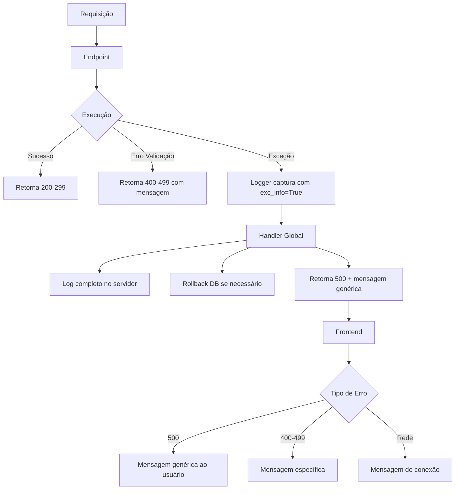

# Tratamento de Exceções - Flask

## 📋 Visão Geral

Este documento descreve a implementação centralizada de tratamento de exceções no Flask, garantindo que erros internos não exponham informações sensíveis ao frontend.

## 🔐 Princípios de Segurança

### Mensagens ao Frontend

**NUNCA expor ao frontend:**
- ❌ Stack traces completos
- ❌ Detalhes de erros de banco de dados
- ❌ Caminhos de arquivos do servidor
- ❌ Variáveis internas
- ❌ Informações de configuração

**SEMPRE retornar:**
- ✅ Mensagem genérica: "Erro interno do servidor"
- ✅ Status HTTP apropriado: `500`
- ✅ Flag `internal_error: true`

### Logs no Servidor

**Logs completos devem conter:**
- ✅ Stack trace completo
- ✅ Timestamp
- ✅ Módulo/função onde ocorreu
- ✅ Mensagem de erro detalhada
- ✅ Contexto da requisição (se relevante)

## 🛠️ Implementação

### 1. Configuração de Logging (main.py)

```python
import logging

# Configurar logging
logging.basicConfig(
    level=logging.INFO,
    format='[%(asctime)s] %(levelname)s in %(module)s: %(message)s',
    handlers=[
        logging.FileHandler('app.log'),  # Log em arquivo
        logging.StreamHandler()          # Log no console
    ]
)
logger = logging.getLogger(__name__)
```

### 2. Handlers Globais de Exceção

#### 2.1 Erros de Banco de Dados

```python
from sqlalchemy.exc import SQLAlchemyError

@app.errorhandler(SQLAlchemyError)
def handle_database_error(e):
    """
    Tratamento global para erros de banco de dados.
    
    - Registra stack trace completo no log do servidor
    - Retorna apenas mensagem genérica ao frontend (segurança)
    - Status 500 Internal Server Error
    """
    # Log completo do erro (stack trace)
    logger.error(f"Database error: {str(e)}")
    logger.error(f"Stack trace:\n{traceback.format_exc()}")
    
    # Rollback da transação em caso de erro
    db.session.rollback()
    
    # Retornar apenas mensagem genérica ao frontend
    return jsonify({
        'error': 'Erro interno do servidor',
        'internal_error': True
    }), 500
```

#### 2.2 Exceções Genéricas

```python
@app.errorhandler(Exception)
def handle_generic_error(e):
    """
    Tratamento global para exceções não capturadas.
    
    - Registra stack trace completo no log do servidor
    - Retorna apenas mensagem genérica ao frontend (segurança)
    - Status 500 Internal Server Error
    """
    # Log completo do erro (stack trace)
    logger.error(f"Unhandled exception: {str(e)}")
    logger.error(f"Stack trace:\n{traceback.format_exc()}")
    
    # Retornar apenas mensagem genérica ao frontend
    return jsonify({
        'error': 'Erro interno do servidor',
        'internal_error': True
    }), 500
```

#### 2.3 Erros HTTP Comuns

```python
@app.errorhandler(404)
def handle_not_found(e):
    """Tratamento para rotas não encontradas"""
    logger.warning(f"404 Not Found: {str(e)}")
    return jsonify({
        'error': 'Recurso não encontrado',
        'not_found': True
    }), 404

@app.errorhandler(405)
def handle_method_not_allowed(e):
    """Tratamento para métodos HTTP não permitidos"""
    logger.warning(f"405 Method Not Allowed: {str(e)}")
    return jsonify({
        'error': 'Método não permitido',
        'method_not_allowed': True
    }), 405
```

### 3. Padrão nos Endpoints

#### ❌ **ANTES** (Expõe detalhes do erro)

```python
@evento_bp.route('/participantes', methods=['GET'])
def listar_participantes():
    try:
        participantes = Participante.query.all()
        return jsonify([p.to_dict() for p in participantes]), 200
    except Exception as e:
        # ❌ PROBLEMA: Expõe detalhes do erro ao frontend
        return jsonify({'error': f'Erro ao buscar: {str(e)}'}), 500
```

#### ✅ **DEPOIS** (Seguro)

```python
import logging
logger = logging.getLogger(__name__)

@evento_bp.route('/participantes', methods=['GET'])
def listar_participantes():
    try:
        participantes = Participante.query.all()
        return jsonify([p.to_dict() for p in participantes]), 200
    except Exception as e:
        # ✅ Log completo no servidor
        logger.error(f"Erro ao listar participantes: {str(e)}", exc_info=True)
        # ✅ Delegar ao handler global (retorna mensagem genérica)
        raise
```

## 📊 Tipos de Resposta

### Sucesso (200-299)

```json
{
  "data": { ... },
  "message": "Operação realizada com sucesso"
}
```

### Erro do Cliente (400-499)

```json
{
  "error": "Mensagem descritiva do erro",
  "validation_error": true,
  "fields": ["campo1", "campo2"]
}
```

### Erro do Servidor (500)

```json
{
  "error": "Erro interno do servidor",
  "internal_error": true
}
```

## 🔍 Exemplo de Log

### Log no Servidor (app.log)

```
[2024-11-28 10:30:45] ERROR in evento: Erro ao listar participantes: (psycopg2.OperationalError) could not connect to server
[2024-11-28 10:30:45] ERROR in evento: Stack trace:
Traceback (most recent call last):
  File "/app/src/routes/evento.py", line 205, in listar_participantes
    participantes = Participante.query.all()
  File "/venv/lib/python3.9/site-packages/sqlalchemy/orm/query.py", line 3490, in all
    return self._iter().all()
  ...
psycopg2.OperationalError: could not connect to server: Connection refused
```

### Resposta ao Frontend

```json
{
  "error": "Erro interno do servidor",
  "internal_error": true
}
```

## 🧪 Testes de Tratamento de Erros

### Teste 1: Erro de Banco de Dados

```python
def test_database_error_handling(client, mocker):
    """Teste: Erro de banco retorna mensagem genérica"""
    # Simular erro de banco
    mocker.patch('src.models.participante.Participante.query', 
                 side_effect=SQLAlchemyError("Connection failed"))
    
    response = client.get('/api/participantes')
    
    assert response.status_code == 500
    assert response.json['error'] == 'Erro interno do servidor'
    assert response.json['internal_error'] == True
    assert 'Connection failed' not in response.json['error']  # Não expõe detalhes
```

### Teste 2: Exceção Genérica

```python
def test_generic_error_handling(client, mocker):
    """Teste: Exceção genérica retorna mensagem segura"""
    # Simular exceção
    mocker.patch('src.routes.evento.Participante.query.all',
                 side_effect=Exception("Internal error details"))
    
    response = client.get('/api/participantes')
    
    assert response.status_code == 500
    assert response.json['error'] == 'Erro interno do servidor'
    assert 'Internal error details' not in str(response.json)  # Não expõe detalhes
```

### Teste 3: Verificar Logs

```python
def test_error_logging(client, caplog):
    """Teste: Erros são registrados nos logs"""
    # Simular erro
    with pytest.raises(Exception):
        # Código que causa erro
        pass
    
    # Verificar se foi logado
    assert 'ERROR' in caplog.text
    assert 'Stack trace' in caplog.text
```

## 📱 Tratamento no Frontend

### Interceptor de Requisições

```javascript
async function fetchAPI(url, options = {}) {
  try {
    const response = await fetch(url, {
      ...options,
      credentials: 'include'
    });
    
    const data = await response.json();
    
    // Erro interno do servidor
    if (response.status === 500 && data.internal_error) {
      console.error('Erro interno do servidor');
      alert('Ocorreu um erro inesperado. Por favor, tente novamente mais tarde.');
      return null;
    }
    
    // Erro de validação
    if (response.status >= 400 && response.status < 500) {
      console.warn('Erro de validação:', data.error);
      return { error: data.error };
    }
    
    return data;
    
  } catch (error) {
    console.error('Erro de rede:', error);
    alert('Erro de conexão. Verifique sua internet.');
    return null;
  }
}
```

### Tratamento de Erros Específicos

```javascript
const response = await fetchAPI('/api/participantes');

if (!response) {
  // Erro interno ou de rede já tratado
  return;
}

if (response.error) {
  // Mostrar erro de validação ao usuário
  showErrorMessage(response.error);
  return;
}

// Sucesso
console.log(response.data);
```

## ✅ Checklist de Segurança

- [x] Handlers globais de exceção implementados
- [x] Logs configurados (arquivo + console)
- [x] Stack traces NUNCA expostos ao frontend
- [x] Mensagens genéricas para erros 500
- [x] Rollback de transações em erros de DB
- [x] Logging com `exc_info=True` nos endpoints
- [x] Frontend trata erros internos gracefully
- [x] Testes de tratamento de erros implementados

## 🚨 O Que NUNCA Fazer

### ❌ Expor Stack Trace

```python
# NUNCA FAÇA ISSO
except Exception as e:
    return jsonify({'error': traceback.format_exc()}), 500
```

### ❌ Expor Detalhes de Banco

```python
# NUNCA FAÇA ISSO
except SQLAlchemyError as e:
    return jsonify({'error': f'Database error: {str(e)}'}), 500
```

### ❌ Imprimir Erros sem Logging

```python
# NUNCA FAÇA ISSO
except Exception as e:
    print(f"ERROR: {e}")  # Não rastreável, não estruturado
    return jsonify({'error': 'Erro'}), 500
```

### ❌ Ignorar Erros

```python
# NUNCA FAÇA ISSO
except Exception:
    pass  # Erro silencioso é pior que erro exposto
```

## 📚 Referências

- [Flask Error Handling](https://flask.palletsprojects.com/en/3.0.x/errorhandling/)
- [Python Logging](https://docs.python.org/3/library/logging.html)
- [OWASP - Error Handling](https://owasp.org/www-community/Improper_Error_Handling)
- [SQLAlchemy Error Handling](https://docs.sqlalchemy.org/en/20/errors.html)

## 🔄 Fluxo de Tratamento de Erros



## 💡 Boas Práticas

1. **Sempre usar logger.error() com exc_info=True**
   ```python
   logger.error("Descrição do erro", exc_info=True)
   ```

2. **Delegar ao handler global**
   ```python
   except Exception as e:
       logger.error(f"Erro: {str(e)}", exc_info=True)
       raise  # Delega ao handler global
   ```

3. **Rollback em erros de DB**
   ```python
   except SQLAlchemyError as e:
       db.session.rollback()
       logger.error(f"DB error: {str(e)}", exc_info=True)
       raise
   ```

4. **Limpar sessão em erros críticos**
   ```python
   except Exception as e:
       session.clear()  # Evita estado inconsistente
       logger.error(f"Erro: {str(e)}", exc_info=True)
       raise
   ```

5. **Monitorar logs regularmente**
   ```bash
   # Ver últimos erros
   grep -i "ERROR" app.log | tail -20
   
   # Monitorar em tempo real
   tail -f app.log | grep -i "error"
   ```
