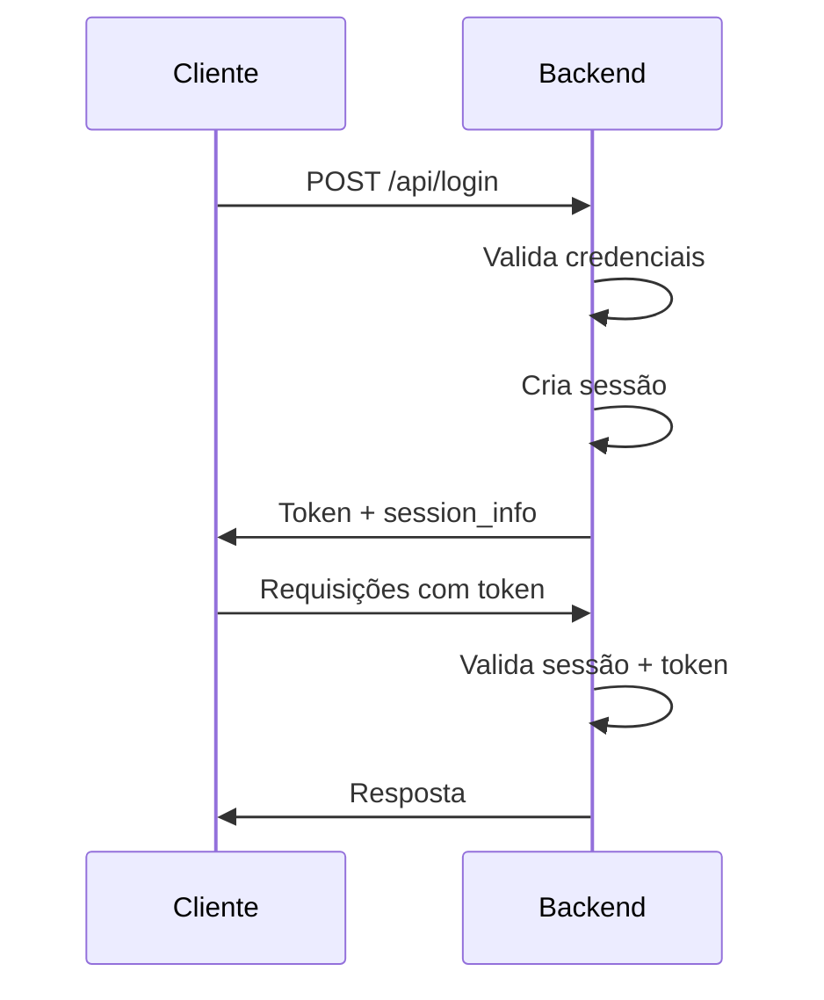
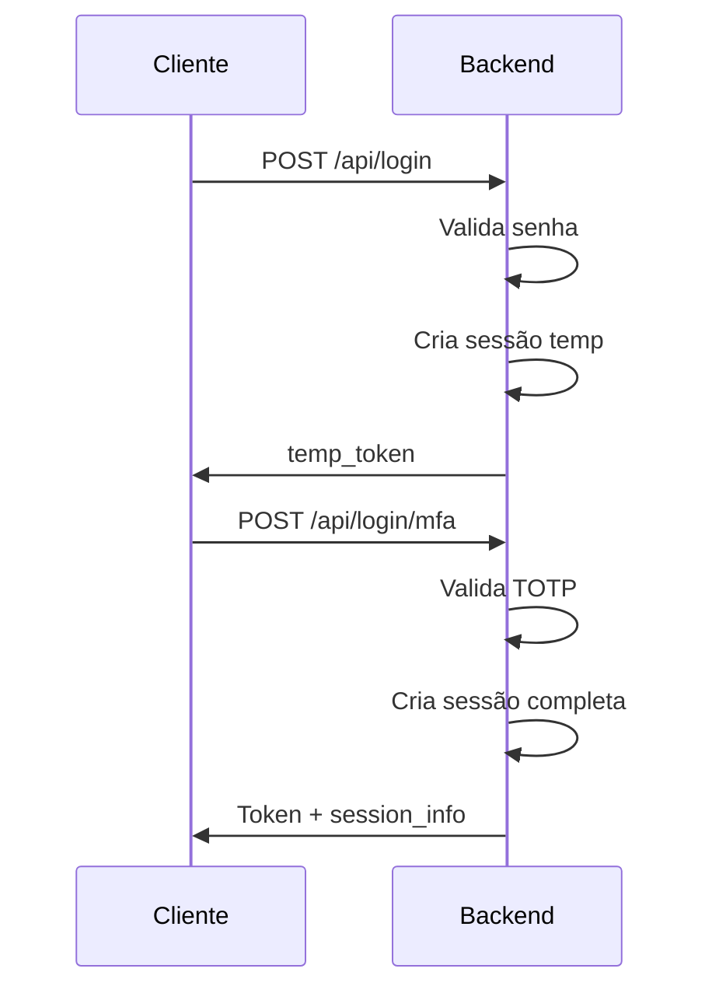

# Gerenciamento de Sessão - Flask Backend

## 📋 Visão Geral

Sistema de gerenciamento de sessão implementado no Flask com controle de:
- **Tempo de inatividade**: 15 minutos
- **Tempo máximo de vida**: 60 minutos
- **Re-login obrigatório** após expiração

## 🔒 Configurações de Segurança

### Configuração Principal (main.py)

```python
# Tempo de inatividade: 15 minutos
app.config['PERMANENT_SESSION_LIFETIME'] = timedelta(minutes=15)

# Tempo máximo de vida: 60 minutos
app.config['SESSION_MAX_LIFETIME'] = timedelta(minutes=60)

# Cookies seguros
app.config['SESSION_COOKIE_SECURE'] = False  # True em produção (HTTPS)
app.config['SESSION_COOKIE_HTTPONLY'] = True  # Previne XSS
app.config['SESSION_COOKIE_SAMESITE'] = 'Lax'  # Proteção CSRF
app.config['SESSION_COOKIE_NAME'] = 'evento_session'
```

### Proteções Implementadas

| Configuração | Valor | Proteção |
|-------------|-------|----------|
| `SESSION_COOKIE_HTTPONLY` | `True` | Previne acesso via JavaScript (XSS) |
| `SESSION_COOKIE_SAMESITE` | `Lax` | Proteção contra CSRF |
| `SESSION_COOKIE_SECURE` | `True` (prod) | Apenas HTTPS em produção |

## 🕐 Controle de Tempo

### 1. Tempo de Inatividade (15 minutos)

A sessão expira se o usuário ficar **15 minutos sem fazer requisições**.

```python
# Middleware verifica em cada requisição
if inactive_time > app.config['PERMANENT_SESSION_LIFETIME']:
    session.clear()
    return jsonify({
        'error': 'Sessão expirada por inatividade',
        'session_expired': True,
        'reason': 'inactivity'
    }), 401
```

### 2. Tempo Máximo de Vida (60 minutos)

A sessão expira **60 minutos após criação**, independente de atividade.

```python
# Middleware verifica tempo total desde criação
if session_age > app.config['SESSION_MAX_LIFETIME']:
    session.clear()
    return jsonify({
        'error': 'Sessão expirada por tempo máximo de vida',
        'session_expired': True,
        'reason': 'max_lifetime'
    }), 401
```

### 3. Atualização Automática

A cada requisição válida, `last_activity` é atualizada:

```python
session['last_activity'] = datetime.utcnow().isoformat()
```

## 🔐 Estrutura da Sessão

Dados armazenados na sessão após login bem-sucedido:

```python
session['user_id'] = user.id                              # ID do usuário
session['username'] = user.username                       # Nome do usuário
session['session_created_at'] = datetime.utcnow()         # Timestamp de criação
session['last_activity'] = datetime.utcnow()              # Última atividade
session['mfa_verified'] = True/False                      # Status MFA
session.permanent = True                                  # Usa PERMANENT_SESSION_LIFETIME
```

## 📡 Endpoints de Sessão

### 1. Login (POST /api/login)

Cria nova sessão após autenticação.

**Request:**
```json
{
  "username": "usuario123",
  "password": "senha123"
}
```

**Response (Sucesso):**
```json
{
  "message": "Login realizado com sucesso",
  "requires_mfa": false,
  "token": "eyJhbGciOiJIUzI1...",
  "user": {
    "id": 1,
    "username": "usuario123",
    "email": "usuario@example.com"
  },
  "session_info": {
    "inactivity_timeout": 15,
    "max_lifetime": 60
  }
}
```

### 2. Login com MFA (POST /api/login/mfa)

Completa login após verificação MFA.

**Request:**
```json
{
  "temp_token": "eyJhbGciOiJIUzI1...",
  "totp_code": "123456"
}
```

**Response:**
```json
{
  "message": "Login com MFA realizado com sucesso",
  "token": "eyJhbGciOiJIUzI1...",
  "user": {...},
  "session_info": {
    "inactivity_timeout": 15,
    "max_lifetime": 60
  }
}
```

### 3. Logout (POST /api/logout)

Encerra sessão atual.

**Response:**
```json
{
  "message": "usuario123 desconectado com sucesso",
  "logged_out": true
}
```

### 4. Status da Sessão (GET /api/session/status)

Verifica status da sessão atual sem exigir token.

**Response (Sessão Ativa):**
```json
{
  "active": true,
  "user_id": 1,
  "username": "usuario123",
  "mfa_verified": true,
  "session_created_at": "2025-11-26T10:00:00",
  "last_activity": "2025-11-26T10:05:00",
  "inactivity_remaining_seconds": 600,
  "lifetime_remaining_seconds": 3300,
  "will_expire_by": "inactivity"
}
```

**Response (Sem Sessão):**
```json
{
  "active": false,
  "message": "Nenhuma sessão ativa"
}
```

### 5. Renovar Sessão (POST /api/session/refresh)

Atualiza `last_activity` para renovar tempo de inatividade.

**Headers:**
```
Authorization: Bearer <token>
```

**Response:**
```json
{
  "message": "Sessão renovada com sucesso",
  "last_activity": "2025-11-26T10:10:00",
  "inactivity_timeout_seconds": 900,
  "lifetime_remaining_seconds": 3000
}
```

## 🛡️ Middleware de Gerenciamento

O middleware `@app.before_request` executa antes de cada requisição:

```python
@app.before_request
def manage_session():
    # 1. Ignora rotas de login/registro
    if request.endpoint in ['user.login', 'user.verify_mfa', 'user.register_user']:
        return
    
    # 2. Verifica sessão existe
    if 'user_id' in session:
        # 3. Marca como permanente
        session.permanent = True
        
        # 4. Verifica tempo máximo de vida (60 min)
        if session_age > 60 minutes:
            session.clear()
            return erro_401
        
        # 5. Verifica inatividade (15 min)
        if inactive_time > 15 minutes:
            session.clear()
            return erro_401
        
        # 6. Atualiza última atividade
        session['last_activity'] = now
```

## 🔄 Fluxo de Autenticação

### Fluxo Sem MFA



### Fluxo Com MFA



## 🚫 Cenários de Expiração

### 1. Expiração por Inatividade

```
Login: 10:00
Última atividade: 10:05
Próxima requisição: 10:25 (20 min depois)
Resultado: SESSÃO EXPIRADA (>15 min de inatividade)
```

**Resposta:**
```json
{
  "error": "Sessão expirada por inatividade. Faça login novamente.",
  "session_expired": true,
  "reason": "inactivity"
}
```

### 2. Expiração por Tempo Máximo

```
Login: 10:00
Última atividade: 10:55 (usuário ativo)
Próxima requisição: 11:05
Resultado: SESSÃO EXPIRADA (>60 min desde criação)
```

**Resposta:**
```json
{
  "error": "Sessão expirada por tempo máximo de vida. Faça login novamente.",
  "session_expired": true,
  "reason": "max_lifetime"
}
```

### 3. Sessão Normal

```
Login: 10:00
Última atividade: 10:05
Próxima requisição: 10:10 (5 min depois)
Resultado: SESSÃO VÁLIDA
```

## 🔍 Decorator de Proteção

O decorator `@token_required` verifica:

1. **Sessão existe** (`user_id` na sessão)
2. **Token JWT válido** (não expirado)
3. **Correspondência** (user_id do token = user_id da sessão)
4. **Usuário existe** no banco de dados

```python
@user_bp.route('/mfa/status', methods=['GET'])
@token_required
def mfa_status(current_user):
    # current_user é automaticamente injetado
    return jsonify({
        'mfa_enabled': current_user.mfa_enabled
    })
```

## 📊 Monitoramento da Sessão

### Frontend: Verificar Sessão Periodicamente

```javascript
// Verificar status da sessão a cada 5 minutos
setInterval(async () => {
  const response = await fetch('/api/session/status');
  const data = await response.json();
  
  if (!data.active) {
    // Redirecionar para login
    window.location.href = '/login';
  } else if (data.inactivity_remaining_seconds < 300) {
    // Avisar usuário: sessão expira em menos de 5 min
    showWarning('Sua sessão expirará em breve');
  }
}, 5 * 60 * 1000);
```

### Frontend: Renovar Sessão Automaticamente

```javascript
// Renovar sessão a cada 10 minutos durante uso ativo
setInterval(async () => {
  await fetch('/api/session/refresh', {
    method: 'POST',
    headers: {
      'Authorization': `Bearer ${token}`
    }
  });
}, 10 * 60 * 1000);
```

## 🧪 Testando o Sistema

### Teste 1: Login e Verificação

```bash
# Login
curl -X POST http://localhost:5000/api/login \
  -H "Content-Type: application/json" \
  -d '{"username": "usuario123", "password": "senha123"}' \
  -c cookies.txt

# Verificar sessão
curl -X GET http://localhost:5000/api/session/status \
  -b cookies.txt
```

### Teste 2: Expiração por Inatividade

```bash
# Login
curl -X POST http://localhost:5000/api/login \
  -d '{"username": "user", "password": "pass"}' \
  -c cookies.txt

# Aguardar 16 minutos

# Tentar acessar rota protegida
curl -X GET http://localhost:5000/api/mfa/status \
  -H "Authorization: Bearer <token>" \
  -b cookies.txt

# Resultado: 401 - Sessão expirada por inatividade
```

### Teste 3: Renovação de Sessão

```bash
# Login
curl -X POST http://localhost:5000/api/login \
  -d '{"username": "user", "password": "pass"}' \
  -c cookies.txt

# Aguardar 10 minutos

# Renovar sessão
curl -X POST http://localhost:5000/api/session/refresh \
  -H "Authorization: Bearer <token>" \
  -b cookies.txt

# Aguardar mais 10 minutos

# Acessar rota protegida (ainda válida)
curl -X GET http://localhost:5000/api/mfa/status \
  -H "Authorization: Bearer <token>" \
  -b cookies.txt
```

## 🔧 Configuração de Produção

### 1. Variáveis de Ambiente

```bash
export SECRET_KEY="sua-chave-secreta-super-forte"
export SESSION_COOKIE_SECURE="True"
export FLASK_ENV="production"
```

### 2. Configuração HTTPS

```python
# Em produção, sempre use HTTPS
app.config['SESSION_COOKIE_SECURE'] = True
```

### 3. Redis para Sessões (Opcional)

Para ambientes com múltiplos servidores:

```bash
pip install Flask-Session redis
```

```python
from flask_session import Session
import redis

app.config['SESSION_TYPE'] = 'redis'
app.config['SESSION_REDIS'] = redis.from_url('redis://localhost:6379')
Session(app)
```

## 📚 Referências

- [Flask Session Documentation](https://flask.palletsprojects.com/en/latest/api/#sessions)
- [Flask-Session Extension](https://flask-session.readthedocs.io/)
- [OWASP Session Management](https://cheatsheetseries.owasp.org/cheatsheets/Session_Management_Cheat_Sheet.html)

## ✅ Checklist de Segurança

- ✅ Sessões expiram por inatividade (15 min)
- ✅ Sessões expiram por tempo máximo (60 min)
- ✅ Cookies com HTTPOnly (previne XSS)
- ✅ Cookies com SameSite (previne CSRF)
- ✅ Cookies Secure em produção (HTTPS only)
- ✅ Token JWT + validação de sessão
- ✅ Limpeza automática de sessões expiradas
- ✅ Endpoints para monitoramento
- ✅ Re-login obrigatório após expiração
